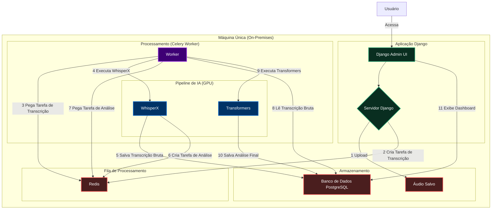

# Diagrama da Arquitetura da Solução

Este documento contém o diagrama da arquitetura da solução, mostrando o fluxo de dados e a interação entre os componentes. O diagrama foi criado usando a sintaxe Mermaid.

---

