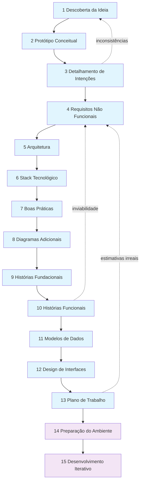
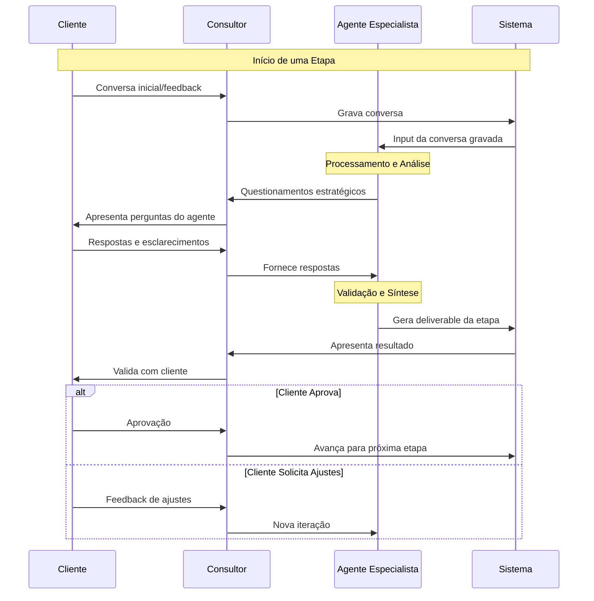
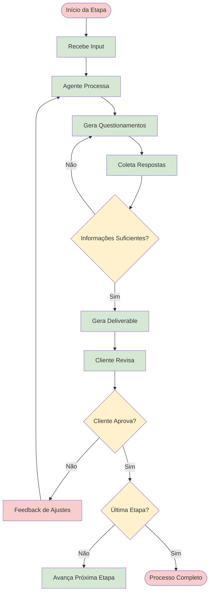
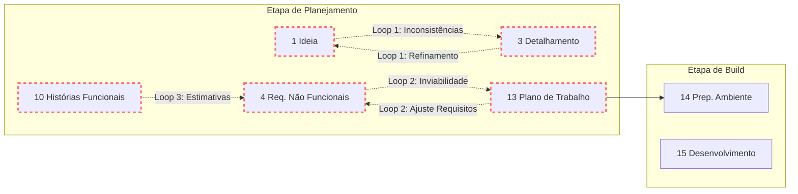

# Macro Flow - Processo de Desenvolvimento de Apps Fullstack com Agentes Especialistas

## Visão Geral

Processo estruturado para desenvolvimento de aplicações fullstack web, utilizando agentes especialistas para guiar questionamentos estratégicos em cada etapa. O processo é baseado em validação contínua com o cliente e aprovação consensual antes de avançar entre etapas.

## Metodologia

- **Input Inicial**: Conversa gravada entre consultor e cliente
- **Validação**: Consenso e aprovação do cliente para avançar etapas
- **Especialização**: Um agente especialista por etapa
- **Iteração**: Loops de refinamento em pontos críticos

---

## Etapa de Planejamento

### 1. Descoberta da Ideia
**Agente Especialista**: Discovery Agent
- **Input**: Conversa gravada inicial (cliente + consultor)
- **Objetivos**: Capturar intenção, contexto e expectativas
- **Questionamentos do Agente**:
  - **Validação**: "A ideia está clara e bem definida?"
  - **Coleta**: "Quais são os principais problemas que o sistema deve resolver?"
  - **Desafio**: "Existem soluções similares no mercado? Como se diferenciará?"
- **Deliverables**: Documento de intenção validado
- **Critério de Passagem**: Cliente aprova o entendimento da ideia

### 2. Protótipo Conceitual
**Agente Especialista**: UX Strategy Agent
- **Input**: Documento de intenção + nova conversa (se necessário)
- **Objetivos**: Visualizar conceito através de protótipo/wireframes
- **Questionamentos do Agente**:
  - **Validação**: "O protótipo representa fielmente a ideia?"
  - **Coleta**: "Quais fluxos de usuário são mais críticos?"
  - **Desafio**: "Este design atende aos diferentes tipos de usuários?"
- **Deliverables**: Protótipo conceitual/wireframes
- **Critério de Passagem**: Cliente valida que o protótipo ilustra sua visão

### 3. Detalhamento de Intenções
**Agente Especialista**: Requirements Agent
- **Input**: Protótipo aprovado + feedback do cliente
- **Objetivos**: Criar requisitos funcionais e não funcionais
- **Questionamentos do Agente**:
  - **Validação**: "Os requisitos cobrem todas as funcionalidades do protótipo?"
  - **Coleta**: "Quais regras de negócio específicas devem ser consideradas?"
  - **Desafio**: "Existe algum requisito conflitante ou ambíguo?"
- **Deliverables**: Documento de requisitos funcionais
- **Critério de Passagem**: Cliente confirma completude dos requisitos
- **Loop**: Pode retornar à Etapa 1 se surgirem inconsistências

### 4. Definição de Requisitos Não Funcionais
**Agente Especialista**: Quality Assurance Agent
- **Input**: Requisitos funcionais validados
- **Objetivos**: Definir performance, segurança, escalabilidade
- **Questionamentos do Agente**:
  - **Validação**: "Os requisitos não funcionais são mensuráveis?"
  - **Coleta**: "Quantos usuários simultâneos o sistema deve suportar?"
  - **Desafio**: "Existe trade-off entre performance e funcionalidade?"
- **Deliverables**: Documento de requisitos não funcionais
- **Critério de Passagem**: Cliente aprova critérios de qualidade

### 5. Definição da Arquitetura
**Agente Especialista**: Solution Architecture Agent
- **Input**: Requisitos funcionais e não funcionais
- **Objetivos**: Desenhar arquitetura técnica da solução
- **Questionamentos do Agente**:
  - **Validação**: "A arquitetura atende todos os requisitos?"
  - **Coleta**: "Existem integrações com sistemas externos?"
  - **Desafio**: "Esta arquitetura é escalável e maintível?"
- **Deliverables**: Diagrama de arquitetura + documentação
- **Critério de Passagem**: Aprovação técnica e de negócio

### 6. Definição do Stack Tecnológico
**Agente Especialista**: Tech Stack Agent
- **Input**: Arquitetura definida
- **Objetivos**: Selecionar tecnologias, frameworks e ferramentas
- **Questionamentos do Agente**:
  - **Validação**: "O stack escolhido suporta a arquitetura?"
  - **Coleta**: "Há preferências ou restrições tecnológicas?"
  - **Desafio**: "Este stack tem comunidade ativa e manutenção?"
- **Deliverables**: Documento de stack tecnológico
- **Critério de Passagem**: Cliente aprova escolhas tecnológicas

### 7. Definição de Boas Práticas
**Agente Especialista**: Code Quality Agent
- **Input**: Stack tecnológico definido
- **Objetivos**: Estabelecer padrões de código, testes e deployment
- **Questionamentos do Agente**:
  - **Validação**: "As práticas são adequadas ao stack escolhido?"
  - **Coleta**: "Qual nível de cobertura de testes é esperado?"
  - **Desafio**: "Como garantir qualidade sem impactar velocidade?"
- **Deliverables**: Guia de boas práticas e padrões
- **Critério de Passagem**: Acordo sobre padrões de qualidade

### 8. Criação de Diagramas Adicionais
**Agente Especialista**: Technical Documentation Agent
- **Input**: Arquitetura + stack + boas práticas
- **Objetivos**: Fluxos de dados, infra de alto nível, integrações
- **Questionamentos do Agente**:
  - **Validação**: "Os diagramas são claros e completos?"
  - **Coleta**: "Quais são os fluxos críticos de dados?"
  - **Desafio**: "Existe algum ponto de falha não documentado?"
- **Deliverables**: Conjunto completo de diagramas técnicos
- **Critério de Passagem**: Documentação técnica aprovada

### 9. Histórias Fundacionais
**Agente Especialista**: Product Strategy Agent
- **Input**: Toda documentação técnica
- **Objetivos**: Criar épicos e histórias de alto nível
- **Questionamentos do Agente**:
  - **Validação**: "As histórias cobrem toda a funcionalidade?"
  - **Coleta**: "Qual é a prioridade de cada épico?"
  - **Desafio**: "Existe dependência crítica entre histórias?"
- **Deliverables**: Backlog de épicos e histórias fundacionais
- **Critério de Passagem**: Priorização aprovada pelo cliente

### 10. Histórias Funcionais Detalhadas
**Agente Especialista**: Product Owner Agent
- **Input**: Histórias fundacionais priorizadas
- **Objetivos**: Detalhar histórias com critérios de aceitação
- **Questionamentos do Agente**:
  - **Validação**: "Os critérios de aceitação são claros?"
  - **Coleta**: "Quais são os cenários de teste para cada história?"
  - **Desafio**: "Existe alguma história muito complexa para ser dividida?"
- **Deliverables**: Backlog detalhado com critérios de aceitação
- **Critério de Passagem**: Histórias prontas para desenvolvimento
- **Loop**: Pode retornar à Etapa 4 se estimativas não forem viáveis

### 11. Modelos de Dados
**Agente Especialista**: Data Architecture Agent
- **Input**: Histórias funcionais + requisitos
- **Objetivos**: Desenhar estrutura de dados e relacionamentos
- **Questionamentos do Agente**:
  - **Validação**: "O modelo suporta todas as funcionalidades?"
  - **Coleta**: "Existem dados legados para migração?"
  - **Desafio**: "O modelo é normalizado e performático?"
- **Deliverables**: Diagrama ER + documentação de dados
- **Critério de Passagem**: Modelo de dados aprovado

### 12. Design de Interfaces
**Agente Especialista**: UI/UX Design Agent
- **Input**: Protótipo conceitual + histórias funcionais
- **Objetivos**: Criar designs finais e sistema de design
- **Questionamentos do Agente**:
  - **Validação**: "As interfaces seguem as melhores práticas de UX?"
  - **Coleta**: "Existe alguma preferência visual ou guideline?"
  - **Desafio**: "O design é responsivo e acessível?"
- **Deliverables**: Designs finais + componentes reutilizáveis
- **Critério de Passagem**: Cliente aprova interfaces finais

### 13. Plano de Trabalho
**Agente Especialista**: Project Management Agent
- **Input**: Todos os entregáveis anteriores
- **Objetivos**: Criar cronograma, estimativas e plano de entrega
- **Questionamentos do Agente**:
  - **Validação**: "O plano é realista e executável?"
  - **Coleta**: "Existem restrições de prazo ou orçamento?"
  - **Desafio**: "Como mitigar riscos identificados?"
- **Deliverables**: Cronograma + plano de riscos + estimativas
- **Critério de Passagem**: Plano aprovado para iniciar desenvolvimento
- **Loop**: Pode retornar à Etapa 4 se estimativas não forem viáveis

---

## Etapa de Build

### 14. Preparação do Ambiente
**Agente Especialista**: DevOps Agent
- **Input**: Plano de trabalho aprovado
- **Objetivos**: Setup de repositórios, CI/CD e ambientes
- **Questionamentos do Agente**:
  - **Validação**: "Todos os ambientes estão funcionais?"
  - **Coleta**: "Quais são os requisitos de segurança para deploy?"
  - **Desafio**: "A pipeline suporta rollback automático?"
- **Deliverables**: Ambientes configurados + pipelines ativas
- **Critério de Passagem**: Ambiente pronto para desenvolvimento

### 15. Desenvolvimento Iterativo
**Agente Especialista**: Development Coach Agent
- **Input**: Histórias priorizadas + ambiente preparado
- **Objetivos**: Acompanhar desenvolvimento seguindo boas práticas
- **Questionamentos do Agente**:
  - **Validação**: "O código segue os padrões estabelecidos?"
  - **Coleta**: "Existem bloqueios ou dependências não resolvidas?"
  - **Desafio**: "A cobertura de testes está adequada?"
- **Deliverables**: Software funcionando em iterações
- **Critério de Passagem**: Entrega contínua com qualidade

---

## Diagramas do Processo

### Fluxo Principal das Etapas

### Interação entre Agentes, Cliente e Consultor

### Fluxo de Decisão por Etapa

### Mapa de Loops e Iterações

---

## Benefícios do Processo

- **Qualidade**: Questionamentos especializados em cada etapa
- **Validação**: Cliente sempre no centro das decisões
- **Rastreabilidade**: Histórico completo de decisões e aprovações
- **Flexibilidade**: Loops permitem refinamento quando necessário
- **Especialização**: Cada agente focado em sua área de expertise

---

## Observações de Implementação

- **Conversas Gravadas**: Sempre que necessário para coletar mais contexto
- **Documentação**: Cada etapa gera artifacts específicos
- **Aprovação**: Cliente deve aprovar explicitamente cada etapa
- **Iteração**: Loops só ocorrem quando há inconsistências detectadas pelos agentes
